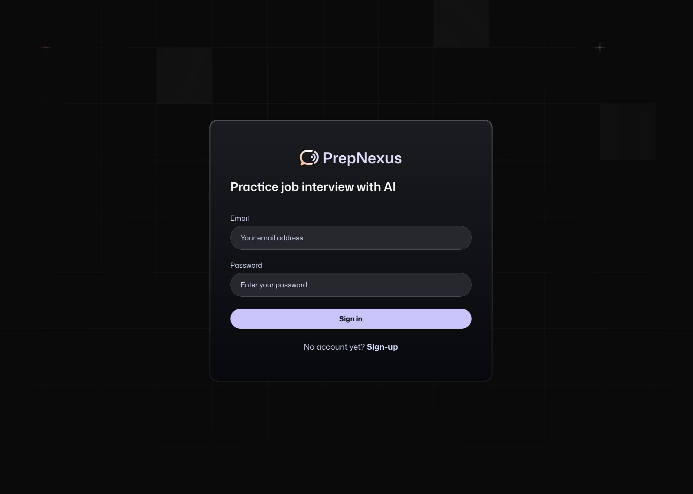
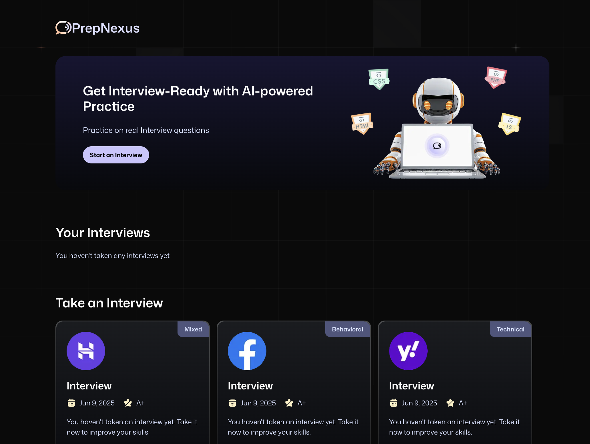
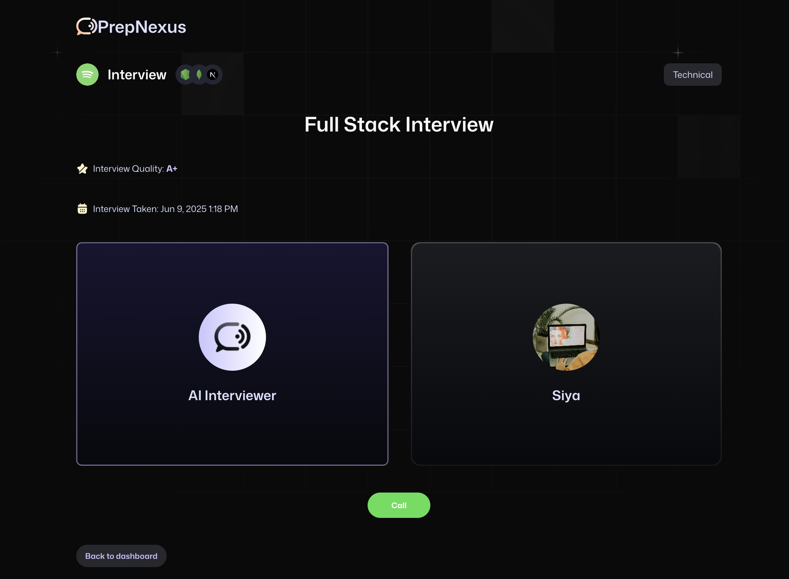

# PrepNexus AI – Your Personalized AI Interview Companion


Live: [prepnexus-ai.vercel.app](https://ai-fullstack.vercel.app/sign-in)  
Source Code: [GitHub Repository](https://github.com/jiyagarg03/prepnexus-ai)

PrepNexus AI is an intelligent, full-stack interview prep platform powered by custom Vapi agents, Firebase authentication, and Google Gemini. The app enables users to simulate real interview conversations with tailored AI workflows and dynamic response generation.

---
---

## Screenshots

| Sign In/Sign up | Home Page | Interview Generation 
|--------|------------------------| ------------------|
|  |  |  |


---

##  Features

-  Firebase Authentication (Email/Password based)
-  Vapi Agent Workflow Integration
-  Custom AI Assistant Creation
-  Dynamic Interview Prompt Generation
-  Google Gemini AI Integration
-  Real-time Response UI
-  TailwindCSS Theming and UI Polish
-  Zod-based Form Validation

---

##  Tech Stack

| Layer          | Technology                               |
|----------------|-------------------------------------------|
| Frontend       | Next.js 15, React 19, TailwindCSS         |
| Auth           | Firebase (Client + Admin SDK)             |
| AI Workflow    | Vapi SDK, Google Gemini                   |
| Forms/UX       | React Hook Form, Zod, Sonner              |
| Styling        | TailwindCSS, Radix UI, Lucide Icons       |

---

## Getting Started

```bash
git clone https://github.com/jiyagarg03/prepnexus-ai
cd prepnexus-ai
npm install
npm run dev
```

---

## Environment Variables
```
FIREBASE_PROJECT_ID=
FIREBASE_PRIVATE_KEY=

GOOGLE_GENERATIVE_AI_API_KEY="

NEXT_PUBLIC_BASE_URL=

NEXT_PUBLIC_VAPI_WEB_TOKEN=
NEXT_PUBLIC_VAPI_WORKFLOW_ID=
```

---

### Status: 
This project is still in development. More features like user feedback generation, and ratings are planned.


---
MIT License • © 2025 Jiya Garg
